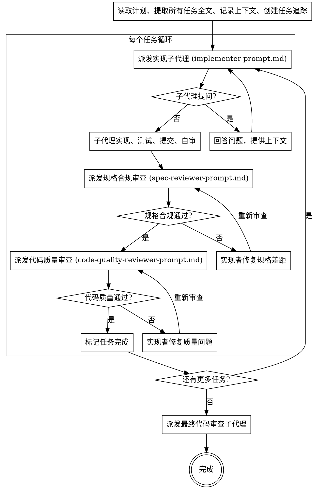

实现 OpenSpec 变更中的任务。

每个任务派发独立子代理执行，经过两阶段审查（规格合规 + 代码质量），确保实现质量。

**为什么用子代理：** 你将任务委托给具有隔离上下文的专门代理。通过精确构造它们的指令和上下文，确保它们保持聚焦并成功完成任务。子代理不应继承你的会话上下文或历史——你精确构造它们需要的内容。这也为你自己的协调工作保留了上下文。

**核心原则：** 每个任务一个新子代理 + 两阶段审查（先规格后质量）= 高质量、快迭代

**持续执行：** 不要在任务之间暂停询问用户。执行计划中的所有任务而不停止。唯一停止的理由是：你无法解决的 BLOCKED 状态、真正阻碍进度的歧义、或所有任务完成。"要我继续吗？"的提示和进度总结是在浪费时间——他们让你执行计划，所以执行就是。

---

**输入**：可选择指定变更名称。如果省略，检查是否可以从对话上下文中推断。如果模糊或有歧义，你**必须**提示用户选择可用的变更。

## 流程图



## 模型选择策略

使用能处理每个角色的最低能力模型，以节约成本和提高速度。

| 任务类型 | 推荐模型 | 信号 |
|---------|---------|------|
| 机械实现任务 | 快速/便宜模型 | 1-2 个文件、完整规格、明确的实现步骤 |
| 集成判断任务 | 标准模型 | 多文件协调、模式匹配、调试 |
| 架构/设计/审查任务 | 最强模型 | 需要设计判断或广泛的代码库理解 |

## 步骤

### 1. 选择变更

如果提供了名称，直接使用。否则：
- 如果用户在对话中提到了某个变更，则从上下文推断
- 如果只有一个活跃变更，自动选择
- 如果有歧义，运行 `openspec list --json` 获取可用变更，使用 **AskUserQuestion 工具** 让用户选择

始终声明："正在使用变更：<name>"

### 2. 前置检查与状态获取

```bash
openspec status --change "<name>" --json
```

解析 JSON 以了解：
- `schemaName`：正在使用的工作流
- `artifacts`：产物列表及其状态（`done` 或其他）
- 哪个产物包含任务

**注意：** `state`（`blocked`、`all_done` 等）来自步骤 3 的 `openspec instructions apply`，而非本步骤的 `openspec status`。

**处理状态：**
- 如果 `state: "blocked"`（缺少产物）：根据缺失产物提示前置技能
  ```
  proposal.md 未完成 → 提示 "请先运行 /openspec-explore"
  design.md 未完成  → 提示 "请先运行 /openspec-propose 生成设计"
  tasks.md 未完成   → 提示 "请先运行 /openspec-propose 生成任务计划"
  ```
- 如果 `state: "all_done"`：表示祝贺，建议归档
- 其他情况：继续实施

### 3. 获取实施指令

```bash
openspec instructions apply --change "<name>" --json
```

返回：
- 上下文文件路径
- 进度（总数、已完成、剩余）
- 带状态的任务列表
- 基于当前状态的动态指令

### 4. 读取上下文文件

从 apply 指令输出中读取 `contextFiles` 列出的**所有文件**。不同 schema 包含的上下文文件不同（如 spec-driven 可能包含 proposal、specs、design、tasks），请以 CLI 动态输出的 `contextFiles` 为准，不要硬编码文件列表。

**提取所有任务的完整文本**（含代码块和命令），不要让子代理去读取文件。一次性读取全部，后续逐任务派发时直接粘贴。

### 5. 显示当前进度

显示：
- 正在使用的模式
- 进度："N/M 个任务已完成"
- 剩余任务概览
- 来自 CLI 的动态指令

### 6. 创建任务追踪

使用 **TaskCreate 工具** 为每个待处理任务创建追踪：
- subject: 任务标题
- description: 任务描述和文件列表
- 状态: pending

### 7. 逐任务执行（子代理循环）

**对每个待处理任务，执行以下流程：**

#### 7a. 派发实现子代理

使用 `implementer-prompt.md` 模板派生 general-purpose 子代理。提供：
- 完整任务文本（从步骤 4 提取）
- 场景设定上下文（架构、依赖、相关 FC24 技能提示）
- 工作目录

**处理子代理提问：**
如果子代理在开始前提出问题——回答它们，提供缺失的上下文，然后重新派发。不要催促它们进入实现。

**处理子代理状态：**

| 状态 | 处理方式 |
|------|---------|
| DONE | 继续规格合规审查 |
| DONE_WITH_CONCERNS | 读取疑虑。如果是正确性或范围问题，先处理再审查。如果是观察性备注，记录后继续审查 |
| NEEDS_CONTEXT | 提供缺失上下文，重新派发 |
| BLOCKED | 评估：①提供更多上下文 → ②升级更强模型 → ③拆分任务 → ④上报用户 |

**绝对不要**忽略升级请求或用同一模型不做改变地重试。子代理说卡住了，就必须有所改变。

#### 7b. 规格合规审查

**必须在实现完成后执行。不能跳过。**

使用 `spec-reviewer-prompt.md` 模板派生 general-purpose 子代理。

**如果审查不通过：**
- 实现者子代理修复问题
- 重新派发规格合规审查
- 重复直到通过

**绝对不要**在规格合规审查通过前进入代码质量审查。

#### 7c. 代码质量审查

**必须在规格合规审查通过后执行。不能在规格合规之前执行。**

使用 `code-quality-reviewer-prompt.md` 模板派生 general-purpose 子代理。

审查要点：
- 每个文件是否有单一明确的职责和良好定义的接口
- 单元是否可以独立理解和测试
- 是否遵循计划中的文件结构
- 是否创建了过大的新文件或显著膨胀了现有文件

**如果审查不通过：**
- 实现者子代理修复问题
- 重新派发代码质量审查
- 重复直到通过

#### 7d. 标记任务完成

审查通过后：
1. 更新 **TaskCreate** 状态为 completed
2. 更新 `tasks.md` 中的复选框：`- [ ]` → `- [x]`
3. 继续下一个任务（回到 7a），不暂停

### 8. 全部完成后

- 派发最终代码审查子代理审查整个实现
- 显示完成摘要：

```
## 实施完成

**变更:** <change-name>
**模式:** <schema-name>
**进度:** N/N 个任务已完成

### 完成的任务
- [x] 任务 1: ...
- [x] 任务 2: ...
...

所有任务已完成！可以归档此变更。
运行 /openspec-archive
```

---

## Prompt 模板文件

| 文件 | 用途 |
|------|------|
| `implementer-prompt.md` | 派发实现者子代理 |
| `spec-reviewer-prompt.md` | 派发规格合规审查子代理 |
| `code-quality-reviewer-prompt.md` | 派发代码质量审查子代理 |

---

## 红线

**绝对不要：**
- 在 main/master 分支上开始实现（除非用户明确同意）
- 跳过审查（规格合规或代码质量）
- 带着未修复的问题继续
- 并行派发多个实现子代理（避免冲突）
- 让子代理读取计划文件（提供完整文本）
- 跳过场景设定上下文（子代理需要理解任务的位置）
- 忽略子代理的问题（回答后再让它们继续）
- 对规格合规"差不多就行"（审查者发现问题 = 没完成）
- 跳过审查循环（审查者发现问题 → 实现者修复 → 重新审查）
- 让实现者的自审替代实际审查（两者都需要）
- **在规格合规 ✅ 之前开始代码质量审查**（顺序错误）
- 在任一审查有未解决问题时移动到下一个任务

**如果子代理提问：**
- 清楚完整地回答
- 如有需要提供额外上下文
- 不要催促它们进入实现

**如果审查者发现问题：**
- 实现者（同一个子代理）修复
- 审查者重新审查
- 重复直到批准
- 不要跳过重新审查

**如果子代理任务失败：**
- 派发修复子代理并提供具体指令
- 不要尝试手动修复（上下文污染）

---

## 约束规则

- 持续处理任务直到完成或被阻塞，不在任务间暂停
- 开始前始终读取上下文文件（来自 apply 指令输出）
- **每个任务必须经过两阶段审查**：规格合规 → 代码质量
- 一次性提取所有任务全文，逐任务派发时直接粘贴
- 审查发现问题 → 实现者修复 → 重新审查 → 循环直到通过
- 不要在同一时间派发多个实现子代理（避免冲突）
- 如果任务有歧义，暂停并询问后再实施
- 如果实施中发现设计问题，建议更新产物
- 保持代码变更最小化，限定在每个任务范围内
- 完成每个任务后立即更新任务复选框
- 遇到错误、阻塞或不明确的需求时暂停 — 不要猜测
- 使用 CLI 输出的 contextFiles，不要假设特定的文件名

**灵活工作流集成：**
- 可随时调用：在所有产物完成之前、部分实施之后、与其他操作交错执行
- 允许更新产物：如果实施中发现设计问题，建议更新 — 不是阶段锁定的，灵活工作
