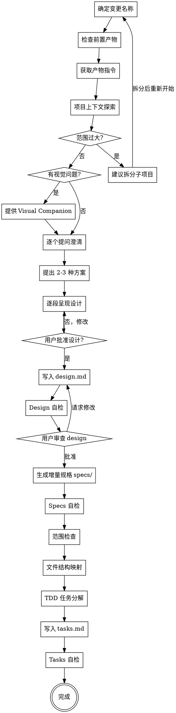

提议新变更 - 生成技术设计、增量规格和实施计划。

我将创建包含以下产物的变更：
- design.md（怎么做 - 技术设计）
- specs/（增量规格 - WHAT the system should do）
- tasks.md（实施步骤 - TDD 任务计划）

**前置条件：** 需要先完成 /openspec-explore 生成 proposal.md。

准备好实施时，运行 /openspec-apply

---

<HARD-GATE>
在用户审批设计之前，绝不调用任何实施技能、编写任何代码、搭建任何项目或执行任何实施操作。无论项目看起来多简单，都必须先呈现设计并获得用户批准。
</HARD-GATE>

## Anti-Pattern: "这个太简单了不需要设计"

每个项目都必须走这个流程。一个 todo 列表、一个单函数工具、一个配置变更——全都一样。"简单"项目恰恰是未审视的假设造成最多浪费的地方。设计可以很短（真正简单的项目几句话就行），但你**必须**呈现设计并获得批准。

---

**输入**：用户的请求应包含变更名称（kebab-case 格式）或对他们想要构建的内容的描述。

## 恢复逻辑

此技能支持**中断恢复**。根据已有产物决定从哪里开始：

```
如果 proposal.md 不存在:
    提示 "请先运行 /openspec-explore 生成提案"
    退出

如果 design.md 不存在:
    执行阶段 A（设计生成）
    继续执行阶段 A2、阶段 B

如果 specs/ 不存在（无增量规格文件）:
    执行阶段 A2（增量规格生成）
    继续执行阶段 B

如果 tasks.md 不存在:
    执行阶段 B（计划生成）

如果全部存在:
    提示 "所有产物已就绪，可以运行 /openspec-apply"
    退出
```

## 流程图



## 步骤

### 前置准备

1. **确定变更名称**

   如果提供了名称，直接使用。否则：
   - 从对话上下文推断
   - 如果只有一个活跃变更，自动选择
   - 如果有歧义，运行 `openspec list --json`，使用 **AskUserQuestion 工具** 让用户选择

   始终声明："正在使用变更：<name>"

2. **检查前置产物**

   检查 `openspec/changes/<name>/` 下是否存在：
   - proposal.md（必须存在）
   - design.md（可能已存在）
   - tasks.md（可能已存在）

   根据**恢复逻辑**决定从哪个阶段开始。

---

## 阶段 A：设计生成（brainstorming 方法论）

**核心变化：** 从"按模板填空"变为"交互式设计对话"

### A1. 获取产物指令

```bash
openspec instructions design --change "<name>" --json
```

解析 JSON 获取：
- `template`：输出文件的结构
- `context`：项目背景（约束，不写入文件）
- `rules`：产物规则（约束，不写入文件）
- `outputPath`：写入位置
- `dependencies`：需要读取的已完成产物

### A2. 项目上下文探索

```
1. 读取 proposal.md（以及 A1 中 dependencies 指定的产物）获取背景
2. 根据 proposal 中的需求，搜索相关代码
   - 使用 MCP graph 工具（semantic_search_nodes）优先
   - 回退到 Grep/Glob 搜索
3. 检查 openspec/specs/ 下的相关规格
4. 检查最近的 git commits，了解项目当前状态
5. 形成对当前系统的初步理解
```

**范围评估：** 在深入提问之前，先评估范围。如果请求描述了多个独立子系统（例如"构建一个包含聊天、文件存储、计费和分析的平台"），立即标记：

```
⚠️ 这个变更涉及多个独立子系统，建议拆分为多个独立的 change：
  1. [子系统 A] - [描述]
  2. [子系统 B] - [描述]
  3. [子系统 C] - [描述]

建议构建顺序: [推荐顺序和依赖关系]
先从哪个开始？
```

帮助用户拆分为子项目后，对第一个子项目走正常设计流程。每个子项目独立经历 spec → plan → implementation 周期。

**在现有代码库中工作：**
- 在提出变更前先探索现有结构，遵循已有模式
- 如果现有代码存在问题影响当前工作（如文件过大、边界不清、职责纠缠），在设计中包含有针对性的改进——就像一个优秀的开发者在他们工作的代码中做的那样
- 不要提出无关的重构。聚焦于服务当前目标的内容

### A3. 提供 Visual Companion（可选）

**仅在预判后续问题会涉及视觉内容时（mockup、布局、架构图等）提供。**

> "我们接下来讨论的内容中，有些部分如果能在浏览器中展示可能会更直观。我可以在过程中为你准备 mockup、架构图、对比图等可视化内容。这个功能比较新且会消耗较多 token。要试试吗？（需要打开一个本地 URL）"

**此邀请必须是独立的一条消息。** 不要与澄清问题、上下文总结或其他内容合并。消息中仅包含上述邀请。等待用户回复后再继续。

如果用户同意，读取详细指南：`visual-companion.md`（本技能目录下的同名文件）。

**每个问题独立决策：** 即使用户接受了 Companion，也要为每个问题单独决定使用浏览器还是终端：
- **使用浏览器**：内容本身就是视觉性的 — mockup、线框图、布局对比、架构图、并排设计对比
- **使用终端**：内容是文本性的 — 需求问题、概念选择、权衡列表、A/B/C/D 文字选项、范围决策

### A4. 技术设计澄清

**信任 proposal.md 的产出。** 不再重复需求层面的提问（做什么、为什么、范围已在 explore 中确认）。仅澄清**技术实现**层面的细节。

**提问原则：**
- 每条消息只问一个问题
- 仅关注"怎么做"而非"做什么"
- 尽可能使用选择题（AskUserQuestion 的 options）

**聚焦维度：**
- 架构决策（组件划分、职责分配）
- 数据流（数据从哪来、怎么流转、存到哪）
- 错误处理（失败场景、重试策略、降级方案）
- 测试策略（单元/集成测试比例、关键测试场景）
- 与现有系统的集成点

**典型提问：**

```
Q1: 数据存储用什么方案？新增表还是扩展现有表？
Q2: API 设计上用 REST 还是复用已有接口？
Q3: 错误场景有哪些？重试还是降级？
Q4: 测试策略怎么定？重点测试什么？
```

### A5. 提出 2-3 种设计方案

当理解了需求后，主动提出 2-3 种设计方案：

```
方案对比框架：
┌──────────┬──────────┬──────────┐
│          │ 方案 A   │ 方案 B   │
├──────────┼──────────┼──────────┤
│ 架构     │ ...      │ ...      │
│ 优点     │ ...      │ ...      │
│ 缺点     │ ...      │ ...      │
│ 复杂度   │ ...      │ ...      │
│ 风险     │ ...      │ ...      │
└──────────┴──────────┴──────────┘
推荐: 方案 X，因为 ...
```

**先推荐你倾向的方案并解释原因。** 使用 AskUserQuestion 让用户选择或混合。

### A6. 逐段呈现设计

将设计方案分段呈现，每段请用户确认。每段的详略程度匹配其复杂度：简单的内容几句话，复杂的内容 200-300 字。

**设计隔离与清晰性原则：**
- 将系统拆分为更小的单元，每个单元有一个明确的目的
- 通过良好定义的接口通信
- 可以独立理解和测试
- 对每个单元，你应该能回答：它做什么？怎么用？它依赖什么？
- 其他人能否不看内部实现就理解这个单元？你能否在不破坏消费者的情况下修改内部实现？如果不能，边界需要调整
- 较小、边界清晰的单元也更容易在上下文中一次性理解，编辑更可靠

```
第 1 段 - 架构概述
"核心组件: A, B, C。A 负责 X，B 负责 Y，C 负责 Z。这个划分合理吗？"

第 2 段 - 数据模型
"新增表 t_xxx，字段: ... 这个数据模型完整吗？"

第 3 段 - API 设计
"新增接口: GET /api/web/xxx, POST /api/web/xxx。这些接口够用吗？"

第 4 段 - 数据流
"数据从 A 流入 B，经过 C 处理，存入 D。这个流程对吗？"

第 5 段 - 错误处理 & 测试
"错误处理策略: ... 测试重点: ... 这样合理吗？"
```

每段确认后再进入下一段。如用户提出修改，返回澄清后重新呈现。

### A7. 写入 design.md

将确认的设计内容写入 `openspec/changes/<name>/design.md`。

**使用 `openspec instructions` 返回的 `template` 作为结构**，填充确认的内容。

**design.md 内容规范：**

```markdown
# <变更名称> - 技术设计

> **For agentic workers:** 本文档与 tasks.md 配合使用。
> tasks.md 中的任务基于本设计生成。

## 架构
[系统架构描述，关键组件关系]

## 组件
### [组件 A]
[职责、接口、依赖]

### [组件 B]
[职责、接口、依赖]

## 数据流
[核心数据流描述]

## 数据模型
[新增/修改的表结构或数据结构]

## API 设计
[新增/修改的接口]

## 错误处理
[错误场景和处理策略]

## 测试方案
[测试策略和关键测试场景]
```

**约束规则：**
- 应用 `context` 和 `rules` 作为约束 — 但不要将它们复制到文件中
- `<context>`、`<rules>`、`<project_context>` 块是给你的约束，不是文件内容
- 读取依赖产物（proposal.md）获取上下文

### A8. Spec 自检（结构化 Review）

写入后，以全新视角审视 spec 文档：

1. **占位符扫描：** 是否存在 TBD、TODO、未完成的章节或模糊的需求？修复它们。
2. **内部一致性：** 各章节之间是否有矛盾？架构描述是否与功能描述匹配？
3. **范围检查：** 是否聚焦到适合单个实施计划的范围内？是否需要进一步拆分？
4. **歧义检查：** 是否有需求可以被两种不同方式解读？如果是，选择一种并明确表达。

发现问题立即修复，不需要再次自检——修复后继续。

**可选：派生子代理审查。** 对于复杂的设计，可以使用 `spec-document-reviewer-prompt.md` 中的模板派生一个 general-purpose 子代理进行独立审查，获取第二视角的反馈。

### A9. 用户审查（Review Gate）

> "设计已写入 `openspec/changes/<name>/design.md`，请审查文件并告诉我是否需要调整，确认后我们将开始编写实施计划。"

等待用户回复。如果用户请求修改，修改后重新运行 Spec 自检循环。**只有用户明确批准后才进入阶段 A2。**

---

## 阶段 A2：增量规格生成

**目的：** 基于已批准的设计，生成增量规格文件（specs/），描述 WHAT the system should do。

### A2.1. 获取 specs 产物指令

```bash
openspec instructions specs --change "<name>" --json
```

解析 JSON 获取：
- `template`：增量规格的结构模板
- `instruction`：Delta 操作格式规范（ADDED/MODIFIED/REMOVED/RENAMED）
- `outputPath`：写入位置（`specs/**/*.md`）

### A2.2. 识别能力变更

分析 design.md，对比 `openspec/specs/` 下的已有规格，识别：

| 类型 | 判断条件 |
|------|---------|
| 新能力 | design 中引入 proposal 列出的全新能力 |
| 修改能力 | design 修改了已有 spec 中定义的行为 |
| 删除能力 | design 移除了已有 spec 中的功能 |

**如果没有涉及任何已有规格且无新能力需要规格化，可跳过此阶段，直接进入阶段 B。**

### A2.3. 生成增量规格文件

为每个能力创建 `openspec/changes/<name>/specs/<capability>/spec.md`。

严格遵循 openspec 定义的格式：

```markdown
## ADDED Requirements

### Requirement: <需求名称>
系统 SHALL ...（使用 SHALL/MUST）

#### Scenario: <场景名称>
- **WHEN** <条件>
- **THEN** <预期结果>
```

**关键约束：**
- `#### Scenario:` **必须 4 个 `#`**
- 每个 Requirement **至少一个 Scenario**
- MODIFIED 必须包含完整更新后内容（不能只写差异）
- REMOVED 必须包含 Reason 和 Migration
- 使用 SHALL/MUST，不用 should/may

### A2.4. Specs 自检

```
格式合规: Scenario 使用 ####（4 个 #），每个 Requirement 至少一个 Scenario
Delta 操作: ADDED/MODIFIED/REMOVED/RENAMED 使用正确
完整性: design.md 中每个组件/功能都有对应的 spec
占位符扫描: 无 TBD、TODO
```

如果发现问题，立即修复。

---

## 阶段 B：计划生成（writing-plans 方法论）

**核心变化：** 从"简单任务列表"变为"TDD + bite-sized + 无占位符"的详细计划

### B1. 获取产物指令

```bash
openspec instructions tasks --change "<name>" --json
```

解析 JSON 获取模板和规则。

### B2. 范围检查（二次确认）

这是 A2 范围评估的安全网。即使 A2 已经做过评估，在计划阶段再次确认。

```
如果 design.md 涉及多个独立子系统:
    建议: "这个变更涉及多个独立子系统，建议拆分为多个 change"
    等待用户决策

单一子系统:
    继续
```

### B3. 文件结构映射

在定义任务前，先列出要创建/修改的文件：

```
文件结构:
- Create: cloud-app/cloud-app-plat/cloud-app-plat-user/src/main/java/.../XxxEntity.java
  职责: 数据库实体
- Create: cloud-app/cloud-app-plat/cloud-app-plat-user/src/main/java/.../XxxDao.java
  职责: 数据访问层
- Create: cloud-app/cloud-app-plat/cloud-app-plat-user/src/main/java/.../XxxService.java
  职责: 业务逻辑
- Create: cloud-app/cloud-app-plat/cloud-app-plat-user/src/main/java/.../XxxWebController.java
  职责: REST API
- Create: cloud-app/cloud-app-plat/cloud-app-plat-user/src/test/java/.../XxxServiceTest.java
  职责: 单元测试
- Modify: cloud-app/cloud-app-plat/cloud-app-plat-user/src/main/resources/db/migration/V20...sql
  职责: 数据库迁移脚本
```

**原则：**
- 每个文件单一职责
- 文件路径精确（修改场景精确到行号范围）
- 新文件遵循项目既有目录结构

### B4. TDD 任务分解

每个任务遵循 TDD 循环，每个步骤 2-5 分钟工作量：

```
任务结构:
- Step 1: 写失败测试（包含完整测试代码）
- Step 2: 运行测试验证失败（包含命令和预期输出）
- Step 3: 写最小实现（包含完整实现代码）
- Step 4: 运行测试验证通过（包含命令和预期输出）
- Step 5: 提交（包含 git 命令）
```

### B5. 写入 tasks.md

输出路径：`openspec/changes/<name>/tasks.md`

**tasks.md 文档格式：**

```markdown
> **For agentic workers:** REQUIRED SUB-SKILL: Use openspec-apply
> to implement this plan task-by-task. Steps use checkbox (`- [ ]`) syntax for tracking.

**Goal:** [一句话目标]

**Architecture:** [2-3 句架构描述]

**Tech Stack:** [关键技术/库]

---

### Task 1: [组件名称]

**Files:**
- Create: `exact/path/to/file.java`
- Modify: `exact/path/to/existing.java:123-145`
- Test: `tests/exact/path/to/test.java`

- [ ] **Step 1: 写失败测试**

```java
@Test
void shouldReturnUserWhenIdExists() {
    // given
    UserEntity entity = new UserEntity();
    entity.setId("123");
    entity.setName("test");

    // when
    UserVo result = userService.getUser("123");

    // then
    assertEquals("test", result.getName());
}
```

- [ ] **Step 2: 运行测试验证失败**

Run: `mvn test -Dtest=UserServiceTest -pl cloud-app/cloud-app-plat/cloud-app-plat-user`
Expected: FAIL

- [ ] **Step 3: 写最小实现**

```java
@Override
public UserVo getUser(String id) {
    UserEntity entity = userDao.getById(id);
    return BeanUtil.copyProperties(entity, UserVo.class);
}
```

- [ ] **Step 4: 运行测试验证通过**

Run: `mvn test -Dtest=UserServiceTest -pl cloud-app/cloud-app-plat/cloud-app-plat-user`
Expected: PASS

- [ ] **Step 5: 提交**

Run: `git add cloud-app/cloud-app-plat/cloud-app-plat-user/src/main/java/.../UserService.java cloud-app/cloud-app-plat/cloud-app-plat-user/src/test/java/.../UserServiceTest.java && git commit -m "feat(user): add user query by id"`

---
```

### B6. Tasks 自检

写入后自检：

```
规格覆盖: design.md 中每个组件/功能都有对应任务
占位符扫描: 无 TBD、TODO、"add validation"、"implement later"
类型一致性: 函数名/方法签名在所有任务中一致（Task 3 中的函数名不能和 Task 7 中的不同）
```

如果发现问题，立即修复。

### B7. 显示最终状态

```bash
openspec status --change "<name>"
```

---

## 禁止的占位符模式

以下是**计划失败**，绝不能出现在 tasks.md 中：

```
"TBD", "TODO", "implement later", "fill in details"
"Add appropriate error handling"
"Add validation"
"Write tests for the above"（不含实际测试代码）
"Similar to Task N"（必须重复代码，执行者可能不按顺序读任务）
只描述做什么但不说怎么做的步骤
引用未在任何任务中定义的类型、函数或方法
```

---

## Key Principles

- **一次一个问题** — 不要用多个问题淹没用户
- **优先选择题** — 可能时用选项代替开放式问题
- **YAGNI 无情执行** — 从所有设计中移除不必要的功能
- **探索替代方案** — 在确定方案前始终提出 2-3 种方案
- **增量验证** — 呈现设计，获得批准后再继续
- **保持灵活** — 当某些内容不清楚时，返回去澄清
- **范围先行** — 在深入细节前评估是否需要拆分

---

## 输出

完成所有产物后，总结：
- 变更名称和位置
- 已创建的产物列表及简要描述
- 准备状态："所有产物已创建！可以开始实施。"
- 提示："运行 /openspec-apply 或让我开始实施任务。"

**约束规则**
- 创建新产物前始终读取依赖产物
- 如果 proposal.md 不存在，引导用户运行 /openspec-explore
- 支持**中断恢复**：如果 design.md 或 tasks.md 已存在，跳过对应阶段
- 写入每个产物后在继续下一个之前验证文件存在
- 使用 `openspec instructions` 的 `template` 作为结构，`context` 和 `rules` 作为约束
- 不要将 `<context>`、`<rules>` 块复制到产物中
- 如果该名称的变更已存在，询问用户是继续它还是创建一个新的
