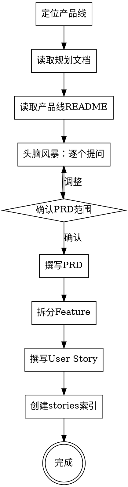

# 产品文档创建

## Overview

从需求出发，沿 **规划文档 → 产品线 README → PRD → Feature → User Story** 的路径，创建完整的产品文档体系。全程通过**逐个提问**确认范围，文档按项目规范命名和存放。

**核心原则**：
- 产品视角，不写技术方案
- 一次一个问题，多选优先
- 每条 Story 独立可验收（INVEST 原则）
- 文档命名和目录严格遵循项目规范
- **编号追溯**：PRD 章节 → Feature → Story 编号必须形成可追溯链，看到编号就能定位来源

### 编号追溯规则

PRD → Feature → Story 三级编号必须关联，看到编号即可定位来源。

**编号体系**：

| 层级 | 格式 | 示例 | 读法 |
|------|------|------|------|
| PRD 文件 | `{产品线}-{序号}-{名}.md` | `G1-01-资源管理.md` | G1 第 1 个 PRD |
| PRD 章节 | §{N}（§1-2 固定前言，§3 起功能章节） | §3、§4 | PRD 内章节 |
| Feature 文件 | `F{PRD序号2位}-{章节号2位}-{名}.md` | `F01-03-Agent引擎管理.md` | PRD#01 §03 |
| Story | `F{PRD序号}-{章节号}-S{序号}` | `F01-03-S1` | 该 Feature 第 1 条 |

**追溯规则**：Story 编号中的每一段都有含义，无需映射表：
- `F01-03-S1` → 前段 `01` 对应 PRD `G1-**01**`，中段 `03` 对应 **§3**，尾段 `S1` 是第 1 条 Story

**关键约束**：
- 每个 PRD 一级章节（§3、§4...）对应一个 Feature
- PRD 序号取 PRD 文件名中的两位序号（`G1-01` 取 `01`）
- 章节号两位零填充（§3 → `03`，§10 → `10`），支持最多 99 个章节
- 单 PRD 产品线同样使用此规则（PRD 序号为 `01`）

**示例**：

单 PRD（`B2-01-消息通知.md`）：
```
PRD §3 消息分类 → F01-03-消息分类管理.md → F01-03-S1, F01-03-S2
PRD §4 消息模板 → F01-04-消息模板管理.md → F01-04-S1, F01-04-S2
PRD §5 渠道配置 → F01-05-渠道配置管理.md → F01-05-S1, F01-05-S2
```

多 PRD（`G1-01` + `G1-02` + `G1-03`）：
```
G1-01 §3 引擎管理 → F01-03-Agent引擎管理.md → F01-03-S1, F01-03-S2
G1-01 §4 智能体管理 → F01-04-智能体管理.md → F01-04-S1, F01-04-S2
G1-02 §3 知识库 → F02-03-知识库管理.md → F02-03-S1, F02-03-S2
G1-02 §4 运行实例 → F02-04-运行实例管理.md → F02-04-S1, F02-04-S2
G1-03 §3 供需市场 → F03-03-供需市场.md → F03-03-S1, F03-03-S2
```

---

## Process Flow



## Checklist

按以下顺序执行，每步完成再进入下一步：

1. **定位产品线** — 根据参数找到对应的规划文档和产品目录
2. **读取上下文** — 读取规划文档和产品线 README，了解现有状态
3. **头脑风暴** — 逐个提问确认产品范围（角色、渠道、场景等）
4. **撰写 PRD** — 按模板生成产品需求文档
5. **拆分 Feature** — 按能力维度拆分 Feature
6. **撰写 User Story** — 按"作为/我想要/以便于"格式 + Given/When/Then 验收标准
7. **创建索引** — 生成 stories/README.md 含依赖图和开发顺序

---

## 第一步：定位产品线

根据 `product` 参数，找到对应的规划文档和产品目录。

### 1.1 查找规划文档

```
docs/04-planning/02-平台产品规划.md  →  找到产品线所属域和编号
```

### 1.2 定位产品目录

```
docs/05-products/{域编号}-{域英文名}/{产品线编号}-{产品线英文名}/
```

**编号规则**：`{域字母}{序号}`，如 `A1`、`B2`、`H5`

**域列表**：

| 域 | 目录 | 名称 |
|---|---|---|
| A | A-平台内核 | 平台内核域 |
| B | B-技术服务 | 技术服务域 |
| C | C-开发者服务 | 开发者服务域 |
| D | D-运维服务 | 运维服务域 |
| E | E-数据服务 | 数据服务域 |
| F | F-连接器平台 | 连接器平台域 |
| G | G-智能体域 | 智能体域 |
| H | H-协作办公 | 协作办公域 |
| I | I-安全合规 | 安全合规域 |

**如果产品目录不存在**：创建目录，命名格式 `{产品线编号}-{英文小写连字符}`

**示例**：`product=B2` → `docs/05-products/B-技术服务/B2-notification/`

---

## 第二步：读取上下文

读取以下文件，了解产品线的规划意图和现有状态：

1. `docs/04-planning/02-平台产品规划.md` — 找到该产品线的规划描述
2. `docs/04-planning/01-生态路线图.md` — 了解战略定位和技术趋势
3. `docs/05-products/{域}/{产品线}/README.md` — 了解当前状态（如已存在）

---

## 第三步：头脑风暴

**关键规则**：
- 一次只问一个问题
- 多选题优先，使用 `AskUserQuestion` 工具
- 从产品视角提问，不涉及技术实现

### 提问维度（按顺序）

| 序号 | 维度 | 目的 | 问题模板 |
|---|---|---|---|
| 1 | 目标用户 | 谁使用这个产品 | "主要服务对象是谁？" |
| 2 | 核心能力 | 产品要具备什么能力 | "需要哪些核心功能？" |
| 3 | 渠道/终端 | 通过什么触达用户 | "需要支持哪些渠道？" |
| 4 | 业务场景 | 在什么场景下使用 | "主要覆盖哪些业务场景？" |
| 5 | 接收对象 | 粒度和范围 | "消息/操作的接收对象粒度？" |
| 6 | 前端范围 | 用户端做到什么程度 | "前端做到什么程度？" |
| 7 | 边界排除 | 明确不做的事 | "Phase 1 明确不做哪些？" |

**根据具体产品调整问题内容**，不局限于上述模板。

---

## 第四步：撰写 PRD

### 4.1 文件命名

```
{产品线编号}-{序号}-{中文名称}.md
```

**示例**：`B2-01-消息通知中心.md`

### 4.2 保存位置

```
docs/05-products/{域目录}/{产品线目录}/{产品线编号}-{序号}-{中文名称}.md
```

### 4.3 使用模板

使用 [PRD 模板](./templates/prd-template.md)，按确认的范围填充各章节。

**章节编号规则**：
- §1 概述、§2 角色定义 — 固定前言，不生成 Feature
- §3 起 — 功能章节，每个一级章节将对应一个 Feature
- 章节编号即为 Feature 编号的来源，**撰写 PRD 时就要考虑后续 Feature 拆分**
- 如果预计有多个 PRD，章节号独立编号即可（Feature 编号会加 PRD 序号前缀区分）

### 4.4 更新产品线 README

在产品线 README.md 中：
- 更新状态（如 "未建" → "规划中"）
- 在底部添加产品文档链接

---

## 第五步：拆分 Feature

### 5.1 拆分原则

按 **"系统要具备什么能力"** 拆分 Feature：

| 拆分维度 | 示例 |
|---|---|
| 按管理对象 | 分类管理、模板管理、渠道配置 |
| 按用户行为 | 消息发送、站内信收件箱 |
| 按外部集成 | 短信渠道、钉钉渠道 |
| 按运营能力 | 发送记录与统计 |

**每个 Feature 满足**：
- 回答"系统要具备什么能力？"
- **对应 PRD 的一个一级章节**（编号追溯）
- 有明确的验收边界

**编号对应规则**（与前面"编号追溯规则"一致）：
- Feature 编号格式：`F{PRD序号2位}-{章节号2位}`
- PRD 序号取自 PRD 文件名（`G1-01` 取 `01`，`B2-01` 取 `01`）
- 章节号两位零填充（§3 → `03`，§10 → `10`）

### 5.2 Feature 命名

```
F{PRD序号2位}-{章节号2位}-{中文名称}.md
```

**示例**：
- 单 PRD `B2-01`：`F01-03-消息分类管理.md`（B2-01 §3）
- 多 PRD `G1-01`：`F01-03-Agent引擎管理.md`（G1-01 §3）
- 多 PRD `G1-02`：`F02-03-知识库管理.md`（G1-02 §3）

### 5.3 保存位置

```
docs/05-products/{域目录}/{产品线目录}/stories/F{PRD序号}-{章节号}-{中文名称}.md
```

---

## 第六步：撰写 User Story

### 6.1 格式规范

**Feature 文件头部**（必须包含 PRD 追溯）：

```markdown
# F{PRD序号}-{章节号} - {中文名称}

> **PRD**：{PRD文件名} §{章节号} | **优先级**：P{0-2} | **Story 数**：{N}
```

**Story 格式**：

```markdown
### F{PRD序号}-{章节号}-S{N}：{用户故事标题}

**作为** {角色}，
**我想要** {做某事}，
**以便于** {获得什么价值}。

**验收标准**：

- Given {前置条件}
- When {操作}
- Then {预期结果}
```

**示例**（多 PRD 场景）：

```markdown
# F01-03 - Agent 引擎管理

> **PRD**：[G1-01 资源管理](../G1-01-资源管理.md) §3 | **优先级**：P0 | **Story 数**：4

### F01-03-S1：注册 Agent 引擎

**作为** 平台管理员，
**我想要** 注册 Agent 引擎，
**以便于** 租户内的智能体可以选择引擎运行。
```

**示例**（单 PRD 场景）：

```markdown
# F01-03 - 消息分类管理

> **PRD**：[B2-01 消息通知中心](../B2-01-消息通知中心.md) §3 | **优先级**：P1 | **Story 数**：4

### F01-03-S1：创建消息分类

**作为** 平台管理员，
**我想要** 创建消息分类，
**以便于** 按类型组织消息模板和发送规则。
```

### 6.2 Story 拆分手法

| 手法 | 说明 |
|---|---|
| 按操作流程 | 列表 → 新增 → 编辑 → 删除 |
| 按数据维度 | 按用户/按角色/按部门 |
| 按异常场景 | 正常流程 → 失败处理 → 边界情况 |
| 按权限 | 管理员操作 / 用户操作 |

### 6.3 INVEST 检查清单

每条 Story 完成后自检：

| 检查项 | 问题 |
|---|---|
| **I**ndependent | 是否尽量不依赖其他 Story？ |
| **N**egotiable | 是否不是死的技术方案？ |
| **V**aluable | 是否对用户/业务有价值？ |
| **E**stimable | 是否能估算工作量？ |
| **S**mall | 是否 1 个迭代内能完成？ |
| **T**estable | 是否有明确的验收标准？ |

### 6.4 红线

**不要在 Story 中写**：
- 数据库表设计
- API 路径和接口定义
- Java 类名、文件路径
- 技术架构方案
- 代码片段

**这些是 Task，不是 Story。** 技术设计交给 `openspec-propose` 流程。

---

## 第七步：创建索引

在 `stories/README.md` 中创建索引，包含：

1. **Feature 概览表**：编号、标题、PRD 章节、Story 数、前置依赖
2. **依赖关系图**：用 Mermaid 或 ASCII 图展示 Feature 间依赖
3. **开发顺序建议**：按批次排列

### 索引模板

使用 [stories README 模板](./templates/stories-readme-template.md)。

---

## 完整目录结构示例

**单 PRD**：
```
docs/05-products/B-技术服务/B2-notification/
├── README.md                          # 产品线概览
├── B2-01-消息通知中心.md               # PRD #01（§3 消息分类、§4 模板、§5 渠道...）
└── stories/
    ├── README.md                      # Feature 索引 + 依赖图
    ├── F01-03-消息分类管理.md          # ← B2-01 §3
    ├── F01-04-消息模板管理.md          # ← B2-01 §4
    ├── F01-05-渠道配置管理.md          # ← B2-01 §5
    └── ...
```

**多 PRD**：
```
docs/05-products/G-智能体域/G1-agent-platform/
├── README.md                          # 产品线概览
├── G1-01-资源管理.md                  # PRD #01（§3 引擎、§4 智能体、§5 模型...）
├── G1-02-运行时管理.md                # PRD #02（§3 知识库、§4 实例、§5 运行时...）
├── G1-03-服务与分发.md                # PRD #03（§3 市场、§4 MCP、§5 协作...）
└── stories/
    ├── README.md                      # Feature 索引 + 依赖图（按 PRD 分组）
    ├── F01-03-Agent引擎管理.md        # ← G1-01 §3
    ├── F01-04-智能体管理.md           # ← G1-01 §4
    ├── F01-05-大模型配置.md           # ← G1-01 §5
    ├── F02-03-知识库管理.md           # ← G1-02 §3
    ├── F02-04-运行实例管理.md         # ← G1-02 §4
    ├── F03-03-供需市场.md             # ← G1-03 §3
    └── ...
```

---

## Key Principles

- **产品视角** — Story 站在用户/管理员/业务系统角度，不写技术方案
- **逐个提问** — 一次一个问题，多选优先，不一次性列出所有问题
- **编号追溯** — PRD §N → Feature F{N} → Story F{N}-S{M}，编号直接对应，无需映射表
- **命名规范** — 严格遵循 `{编号}-{序号}-{中文名称}` 和 `F{编号}-{名称}` 格式
- **INVEST 原则** — 每条 Story 独立、有价值、可测试
- **技术设计后置** — Story 不含技术方案，实现细节交给 openspec 流程
