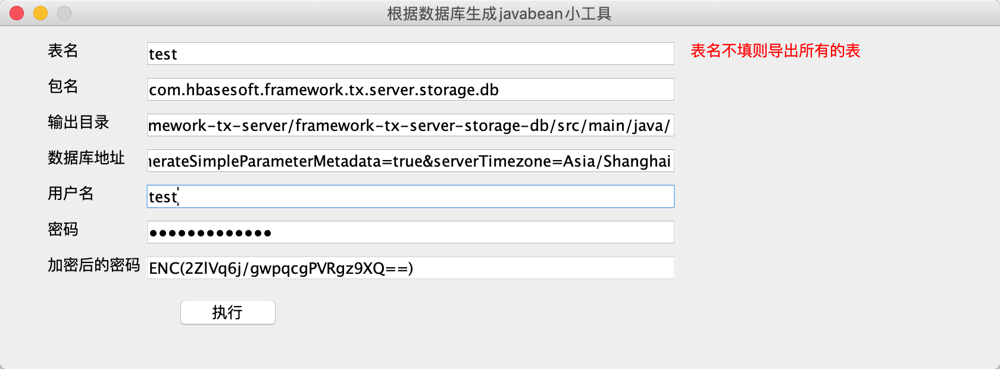

### 特性

1. O/R mapping不用设置xml，零配置便于维护  
2. 不需要了解JDBC的知识
3. SQL语句和java代码的分离  
4. 可以自动生成SQL语句  
5. 接口和实现分离，不用写持久层代码，用户只需写接口，以及某些接口方法对应的sql 它会通过动态代理自动生成实现类  
6. 支持自动事务处理和手动事务处理  
7. Dao整合了Hibernate+mybatis的两大优势，支持实体维护和SQL分离  
8. SQL支持脚本语言  
9. 可以无缝集成Hibernate、Spring等第三方框架，也可以单独部署运行，适应性强。
10. 支持JPA的CriteriaQuery API，并且提供了类似于Mybatis plus中 QueryWrapper和LambdaQueryWrapper的这种易用的写法。

### 快速上手

1、 项目的pom.xml中引入maven配置

```
<dependency>
	<groupId>com.hbasesoft.framework</groupId>
	<artifactId>framework-db-core</artifactId>
	<version>${framework.version}</version>
</dependency>
```

2、在application.yml中配置数据源

```
master: #主数据库配置
 db:
  type: mysql # 数据库类型，支持oracle、h2、mysql 等等， 底层用Hibernate，其支持的改框架都支持
  url: jdbc:mysql://192.168.1.1:3306/member?useUnicode=true&characterEncoding=UTF-8&generateSimpleParameterMetadata=true&serverTimezone=Asia/Shanghai
  username: test # 用户名
  password: sgp # 密码，支持加密模式，密文需要用ENC(密文)包裹
```

3、具体使用参考下面的章节

### PO (persistent object)的生成

db框架底层使用的Hibernate实现的，所以PO的规则和Hibernate保持一致， 可以使用第三方工具生成，我们也提供一个工具直接可以根据数据库中的表生成PO和DAO(Data Access Object)。 



1. 直接运行com.hbasesoft.framework.db.cg.DBTable2JavaBean类中的main方法，会打开一个UI界面。
2.  填写需要生成转化的表名称（不填会查询数据库中所有的表）
3.  配置数据库的连接地址和用户名密码
4.  点击生成
4.  该工具最后还提供了密码加密工具，可以用于application.yml中数据源的密码加密

### 单表的增删改查

生成好的DAO会继承 com.hbasesoft.framework.db.core.BaseDao<T> ，里面提供了大量的单表操作方法，当然如果不想使用这些方法，也可以不继承这个接口。

> BaseDao.java

```
public interface BaseDao<T extends BaseEntity> {
    CriteriaBuilder criteriaBuilder(); // JPA工厂方法，做一些JPA支持的高级用法

    T get(Serializable id); // 根据id来获取数据
    <M> M getByCriteria(CriteriaQuery<M> criteria); // 根据条件查询，其中 criteria需要通过CriteriaBuilder来生成，具体参考JPA CriteriaQuery的用法
    T getBySpecification(CriterialQuerySpecification<T> specification); // 根据条件查询， PA CriteriaQuery简化写法
    T get(QuerySpecification<T> specification); // 根据条件查询, 参考Mybatis plus中 QueryWapper的用法
    T getByLambda(LambdaQuerySpecification<T> specification); // 根据条件查询，参考Mybatis plus中 LambdaQueryWapper的用法
    
    List<T> queryAll(); // 查询所有数据
    <M> List<M> queryByCriteria(CriteriaQuery<M> criteria); //根据条件查询
    List<T> queryBySpecification(CriterialQuerySpecification<T> specification); // 根据条件查询
    List<T> query(QuerySpecification<T> specification); // 根据条件查询
    List<T> queryByLambda(LambdaQuerySpecification<T> specification); // 根据条件查询
    <M> PagerList<M> queryPagerByCriteria(CriteriaQuery<M> criteria, int pageIndex, int pageSize); // 根据条件分页查询
    PagerList<T> queryPagerBySpecification(CriterialQuerySpecification<T> specification, int pageIndex, int pageSize); // 根据条件分页查询
    PagerList<T> queryPager(QuerySpecification<T> specification, int pageIndex, int pageSize); // 根据条件分页查询
    PagerList<T> queryPagerByLambda(LambdaQuerySpecification<T> specification, int pageIndex, int pageSize); // 根据条件分页查询
    
    void save(T entity); // 保存数据
    void saveBatch(List<T> entitys); // 批量保存
    
    void update(T pojo); // 更新数据
    void updateBatch(List<T> entitys); // 批量更新
    void updateByCriteria(CriteriaUpdate<T> criteria); // 根据条件来做更新
    void updateBySpecification(CriterialUpdateSpecification<T> specification); // 根据条件来做更新
    void update(UpdateSpecification<T> specification); // 根据条件来做更新
    void updateByLambda(LambdaUpdateSpecification<T> specification); // 根据条件来做更新
    
    void delete(T entity); // 删除数据
    void deleteById(Serializable id); // 根据id来删除
    void deleteBatch(Collection<T> entities);  //批量删除
    void deleteByIds(Collection<? extends Serializable> ids); // 根据id批量删除
    void deleteByCriteria(CriteriaDelete<T> criteria); // 根据条件删除
    void deleteBySpecification(CriterialDeleteSpecification<T> specification); // 根据条件删除
    void delete(DeleteSpecification<T> specification); // 根据条件删除
    void deleteByLambda(LambdaDeleteSpecification<T> specification); // 根据条件删除
} 
```

> ICourseDao.java

```
@Dao
public interface ICourseDao extends BaseDao<CourseEntity> {
}
```

> BaseDaoTester.java

```
/** 依赖spring 注入DAO */
@Resource
private ICourseDao iCourseDao;

/** 根据某个属性查询 */
@Test
public void getByProperty() {
      CourseEntity entity = iCourseDao.get(q -> q.eq(CourseEntity.COURSE_NAME, "语文").build());
      Assert.equals(entity.getId(), "1", ErrorCodeDef.SYSTEM_ERROR);
}

 /** 统计*/
@Test
public void countCourse() {
    CriteriaBuilder cb = iCourseDao.criteriaBuilder();
    CriteriaQuery<Long> query = cb.createQuery(Long.class);
    Root<CourseEntity> root = query.from(CourseEntity.class);
    query.select(cb.count(root));
    Long count = iCourseDao.getByCriteria(query);
    Assert.isTrue(count.intValue() == NUM_3, ErrorCodeDef.SYSTEM_ERROR);
}

```
### 复杂SQL查询及分页

多表之间的关联查询建议直接写SQL，SQL语句我们支持直接写在@Sql方法注解上， 也支持写成单独文件，文件名称为类名称\_方法名称.sql、类名称\_方法名称.数据库类型.sql 、数据库类型/类名称\_方法名称.sql这三种格式。

> IStudentDao.java

```
@Dao
public interface IStudentDao extends IBaseDao<StudentEntity> {

    void createTable();

    @Sql("select count(1) from t_student_course sc, t_course c "
        + "where sc.course_id = c.id and sc.score >= 60 and c.course_name = :courseName")
    int countCoursePass(@Param("courseName") String courseName);

    @Sql("select count(1) from t_student")
    int countStudentSize();

    /** 
     * 分页只要在方法上加上@Param(Param.PAGE_INDEX) int pageIndex, @Param(Param.PAGE_SIZE) int pageSize 
     * 两个参数就会自动分页，SQL中不用写任何关于分页的处理
     *  返回的List是com.hbasesoft.framework.db.core.utils.PagerList,这个list可以当成普通list使用，它的信息里面包含了分页所需要的参数<E>
     * /
    @Sql
    PagerList<StudentEntity> queryStudentCourse(@Param("entity") StudentEntity studentEntity,
        @Param(Param.PAGE_INDEX) int pageIndex, @Param(Param.PAGE_SIZE) int pageSize);
 }
```

多条SQL用;做分割， 注意结尾不能包含;

> IStudentDao_createTable.sql

```
DROP TABLE IF EXISTS `t_student_course`;

DROP TABLE IF EXISTS `t_student`;

DROP TABLE IF EXISTS `t_course`;

CREATE TABLE `t_student` (
	id       varchar(32)       primary key,
	name     varchar(32)       not null,
	age      int(3)            not null
);

insert into t_student(id, name, age) values ('1', '张三', 18);
insert into t_student(id, name, age) values ('2', '李四', 19);
insert into t_student(id, name, age) values ('3', '王五', 18);
insert into t_student(id, name, age) values ('4', '赵六', 17)
```

sql内容使用了Velocity模版，支持使用#if #else等语法。注意：为了防止SQL注入，经过模版解析后的sql中的参数需要使用冒号来赋值。

> IStudentDao_queryStudentCourse.h2.sql  

```
select 
   s.id, s.name, s.age, sc.score, c.course_name
from 
   t_student s,
   t_course c,
   t_student_course sc
where
   s.id = sc.student_id
and
   c.id = sc.course_id
#if($entity.name)
  and s.name like :entity.name
#end

#if($entity.age)
  and s.age = :entity.age
#end
```

### 批量数据处理

超过一千条以上的数据需要使用 com.hbasesoft.framework.db.hibernate.IBaseDao.executeBatch(String sql, Collection<Object[]> objcts, int commitNumber) 方法来处理。

```
@Test
public void executeBatch() {
    int s1 = iStudentDao.countStudentSize();
    
    // 读取200万行的csv文件， 每次读取10000行
    IOUtil.batchProcessFile(new File("Student.csv"), line -> {
        if (StringUtils.isNotEmpty(line)) {
            String[] strs = StringUtils.split(line, GlobalConstants.SPLITOR);
            if (strs.length >= 2) {
                return new Object[] {
                    CommonUtil.getTransactionID(), strs[0], strs[1]
                };
            }
        }
        return null;
    }, (students, pageIndex, pageSize) -> {
         
         // 批量插入数据，每1000条提交一次
        iStudentDao.executeBatch("insert into t_student (id, name, age) values (?, ?, ?)", students,
            GlobalConstants.DEFAULT_LINES);
        return true;
    });
    int s2 = iStudentDao.countStudentSize();
    Assert.isTrue(s2 - s1 == NUM_200000, ErrorCodeDef.SYSTEM_ERROR_10001);
}
```

### 事务控制

框架支持手动和Spring注解两种方式来控制事务
1、 Spring 注解方式

```
/*
* 该注解可以打在方法上,也可以打在类上
*/
@Transactional(isolation=Isolation.REPEATABLE_READ,propagation=Propagation.REQUIRED,readOnly=false)
public void transfer(final Integer from, final Integer to, final Float money) {
	accountDao.subMoney(from,money);
	int i = 1/0;
	accountDao.addMoney(to,money);
}
```

2、 手动控制

```
// 初始化事务定义
DefaultTransactionDefinition def = new DefaultTransactionDefinition();

// 设置事务传播方式
def.setPropagationBehavior(TransactionDefinition.PROPAGATION_REQUIRED);

// 从事物管理器中获取TransactionManager， 并获取TransactionStatus
TransactionStatus status = TransactionManagerHolder.getTransactionManager().getTransaction(def)

try {
    // TODO: 执行业务代码
    
    // 提交当前事务
    TransactionManagerHolder.getTransactionManager().commit(status);

} catch(Exception e) {
     TransactionManagerHolder.getTransactionManager().rollback(status);
}
```
### 多数据库源

框架中支持多数据源配置， 默认系统会加载master数据源，可以通过@DataSource方法注解 或者 DynamicDataSourceManager.setDataSourceCode(String) 来进行多数据源的切换， 这种方式也可以在数据库读写分离的场景使用。

> application.yml

```
master: #主数据库配置
 db:
  type: mysql
  url: jdbc:mysql://192.168.0.1:3306/sgp_agent?useUnicode=true&characterEncoding=UTF-8&generateSimpleParameterMetadata=true&serverTimezone=Asia/Shanghai
  username: test
  password: ENC(9cOZdwpiByhh7bQcgNDXjNAfUKmujhB2)

gongcheng: #工程数据库配置
 db:
  type: oracle
  driverClass: oracle.jdbc.driver.OracleDriver
  url: jdbc:oracle:thin:@192.168.0.1:1521:CSORCL
  username: test
  password: ENC(9cOZdwpiByhh7bQcgNDXjNAfUKmujhB2)
  validationQuery: SELECT 1 FROM DUAL
 hibernate:
  dialect: org.hibernate.dialect.OracleDialect
  hbm2ddl:
    auto: none
  show_sql: false
  format_sql: false
  temp:
    use_jdbc_metadata_defaults: false

```
> MaterialServiceImpl.java

```
@Override
@Transactional
@DataSource(DataSourcePrefixDef.GONG_CHENG)
public DataMaterialEntity getDataMaterialInfoFromGC(String stdCode, String materialCode) {
    return materialDao.getDataMaterialInfoFromGC(stdCode, materialCode);
}
```

不加注解默认为master数据源
> DataOrderRecordService.java

```
@Transactional
void saveDataOrderRecord(DataOrderRecordEntity orderRecordEntity, String stdCode);

```

> OrderController.java

```
@Override
	public String creatGCBill(@RequestBody Tcis2CrmOrderItemInput tcis2CrmOrderItemInput) {
		
           ......
           
		try {
			List<BillDetail> billDetails = Lists.newArrayList();
			if (CollectionUtils.isNotEmpty(tcis2CrmOrderItemInput.getCrmOrderGoods())) {
				tcis2CrmOrderItemInput.getCrmOrderGoods().stream()
						.filter(crmOrderGoods -> TcisCommonConstant.MATERIAL.equals(crmOrderGoods.getGoodsType()))
						.forEach(crmOrderGoods -> {
							DataMaterialEntity dataMaterialInfo = materialService.getDataMaterialInfoFromGC(stdCode, crmOrderGoods.getProductSn());
						 ......
						});
			}
			......
		} catch (Exception e) {
			DataOrderRecordEntity dataOrderRecordEntity = new DataOrderRecordEntity();
			.......
			dataOrderRecordService.saveDataOrderRecord(dataOrderRecordEntity, stdCode);
		}

		return gcBill.getExceedID();
	}
```

### 配置参数说明


